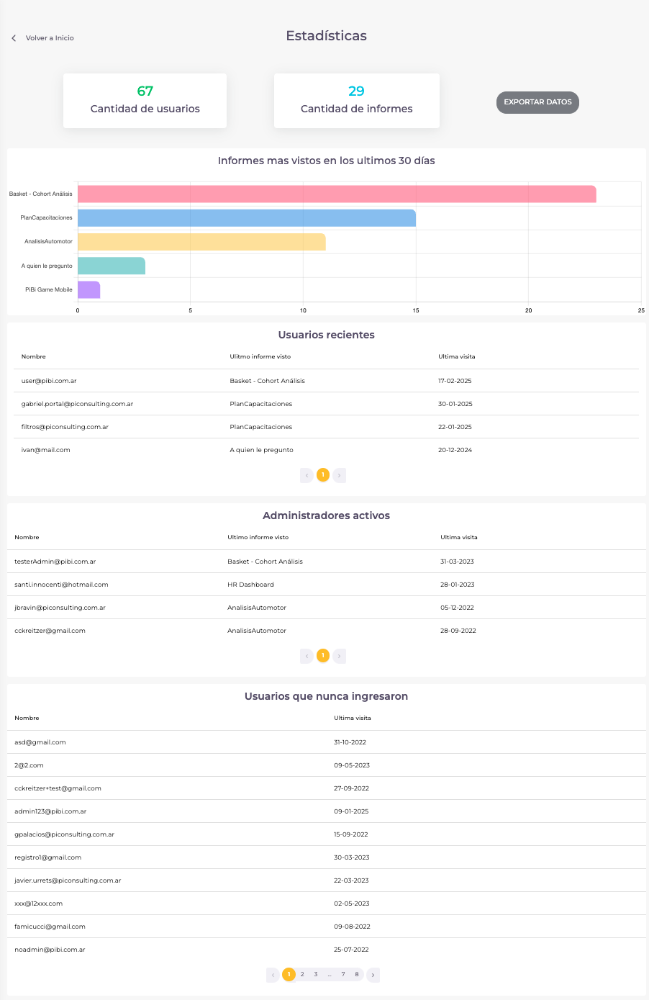

# ¿Cuales son las estadísticas que tenemos en PiBi? 

Las estadísticas de PiBi contienen varios datos en esta pantalla.

Las primeras 2 pantallas que vemos dentro de la sección nos muestran el número total de usuarios y el número total de informes que poseemos.

En el medio (de izquierda a derecha) nos encontramos con 2 tablas. 

La primera tabla muestra la cantidad de "Administradores activos" con los siguientes datos: Nombre, Último informe visto y Última visita. 

En la segunda tabla se muestran los "Usuarios que nunca ingresaron", proporcionando la siguiente información: Nombre y Última visita.

Finalmente, encontramos una tabla y un gráfico (de izquierda a derecha).

La tabla "Usuarios recientes" incluye los siguientes datos: Nombre, Último informe visto y Última visita.

El gráfico muestra "Informes más vistos en los últimos 30 días", con la cantidad total de visualizaciones para cada informe.

