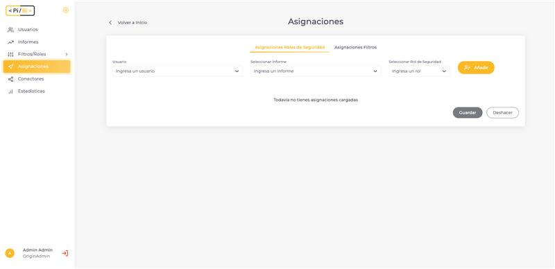

[Volver](index.md)

# ¿Qué son y para qué usamos las asignaciones en PiBi? 

En PiBi las Asignaciones nos permitirán indicar los permisos de un usuario para acceder a los informes. Vamos a poder configurar asignaciones de roles de seguridad y de filtros. Ambas opciones nos permitirán definir los datos que verán los usuarios en cada informe. 

En la sección *Asignaciones* vamos a crear lotes de asignaciones, eligiendo uno o varios usuarios, uno o varios informes y el rol de seguridad o filtro que queremos asignar. 

NOTA: *Si no queremos filtrar nuestros informes usando filtros ni roles de seguridad, podemos crear asignaciones de rol de seguridad “Ninguno”.* 

## Asignaciones de roles de seguridad 

Vamos a asignar lotes de roles de seguridad seleccionando uno o varios usuarios, uno o varios informes y por último el rol de seguridad que queremos asignar. Recordemos que las opciones de roles de seguridad que tendremos serán las que agregamos en dicha sección, más los roles *Admin* y *Ninguno* que son creados por defecto por PiBi. 

Al completar usuarios, informes y rol pulsamos en *Añadir*.

Cuando pulsamos en *Añadir*, PiBi controla que la asignación de rol de seguridad no exista en la base de datos. Cuando una asignación existe en la base de datos, podremos ver un indicador  en la fila. Tengamos en cuenta que, para un usuario e informe particular, solo podremos tener un rol de seguridad asignado. Si procedemos con la operación nuestra nueva asignación pisaría la vieja registrada en la base de datos. Si no queremos proceder en ese reemplazo, podemos quitar las filas del indicador con el icono de basura.

Cuando estemos seguros de las asignaciones que vamos a crear, pulsamos en *Guardar*. 

¡Listo! Ya tenemos asignaciones de roles de seguridad creadas. 

## Asignaciones de filtros 

Vamos a asignar lotes de filtros seleccionando uno o varios usuarios, uno o varios informes y por último el filtro que queremos asignar. Recordemos que las opciones de filtros que tendremos serán las que agregamos en dicha sección. 

Al completar usuarios, informes y filtro pulsamos en *Añadir*. Tengamos en cuenta que tendremos que seleccionar el filtro y completar la condición y el valor del mismo. 

Cuando estemos seguros de las asignaciones que vamos a crear, pulsamos en *Guardar*. 

¡Listo! Ya tenemos asignaciones de filtros creadas.  

