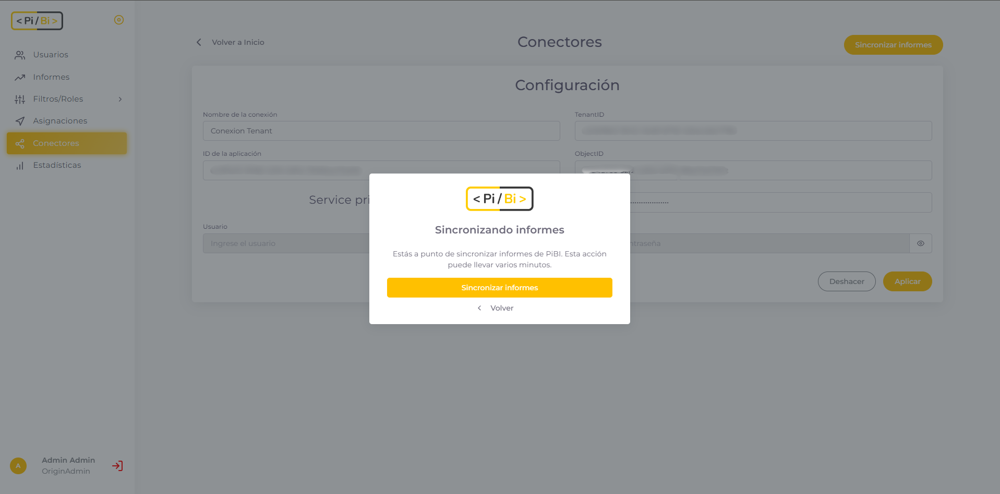

# ¿Qué es un conector en PiBi? 

Un conector es una configuración que nos va a permitir acceder a los reportes de Power BI. En PiBi debemos completar la información del conector para indicar en qué Tenant se encuentran dichos reportes. 

Para validar nuestros permisos de acceso a estos informes podemos elegir entre dos tipos de conexión. 

Uno de ellos se llama Service Principal y consiste en indicarle al conector el *Id de la aplicación* y el *Secret Key*. Estos códigos los obtenemos creando una *App Registration en Azure*. El campo *ObjectId* es el Object Id de Managed Identity del Service Principal y es un campo no requerido pero si obligatorio para informes con orígenes de *Azure Analysis Services*.

La otra opción de acceso es *Master User* en la cual debemos ingresar un usuario y contraseña. Lo particular es que este usuario debe tener permisos de administrador en Power BI al que nos estamos conectando y permisos sobre la App registrada. 

Cuando completamos los datos y pulsamos en el botón *Aplicar* se guardará  el conector con los datos ingresados.

# Sincronizar Informes 

Luego de tener configurado nuestro conector vamos a poder sincronizar la lista de informes de PiBi con los datos que se encuentran compartidos en los espacios de trabajo de Power BI. 

Cuando pulsemos en *Sincronizar Informes*, PiBi buscará los informes en las áreas de trabajo compartidas en Power Bi y actualizará su base de informes. Luego se aplicará el rol de seguridad *Administrador* para todos los usuarios administradores de PiBi y para todos los informes recientemente sincronizados. De manera que los usuarios administradores de PiBi siempre podrán consultar la información de los informes. 

Además, PiBi cuenta con dos sincronizaciones automáticas por día las cuales mantienen actualizados los informes. 

# Cambiar conector existente

Puede ocurrir que por vencimiento de una key o cambios en nuestra organización tengamos que cambiar el conector de PiBi. En este escenario es **muy importante** hacer el cambio en un orden determinado puesto que si configuramos un conector sin ningún acceso en PowerBi, la sincronización de PiBi resolverá que hemos eliminado workspaces y dejaremos de ver asignaciones.

**¿Cómo lo hacemos correctamente?**
1. Registrar nueva App en Azure o Service Principal para la conexión con los permisos como nos guía la documentación.
2. Ingresar a Power Bi Service para agregar la aplicación registrada como Administrador de las Áreas de Trabajo que teníamos configuradas.
3. Ingresar a PiBi y cambiar los valores en menú Conectores.
4. Sincronizar informes en menú de Conectores.
Tengamos presente que no hacer este orden exacto puede provocar la pérdida de asignaciones puesto que si sincronizamos un conector que no tiene permisos en Áreas de Trabajo, asumirá que las quitamos y no queremos verlas.

# Utilizar PiBi con Analysis Services

Si nuestros origenes de informes estan basados en conexiones Live Connection contra Analysis Services, vamos a necesitar ejecutar operaciones sobre el modelo tabular para que PiBi puedra traernos la información.

Lo primero y principal es que nuestro conector tenga el Object Id de nuestro Service Principal correctamente cargado. 

Lo segundo es darle permisos al service principal sobre los roles del modelo. Para ello necesitaremos Visual Studio con data tools o SQL Management Studio. Cuando abrimos el modelo podemos apreciar que por defecto existe un rol Admin (como el que viene por defecto en PiBi) y si creamos otros allí estarán. Para que PiBi pueda leer el modelo necesitaremos agregar como usuario al Service Principal de conectores de PiBi a Admin y a todos los roles que querramos utilizar en PiBi.

Con dichos permisos los informes que estén en una área de trabajo sincronizada con PiBi y un rol que coincida con los que puede ver el Service Principal, el informe renderizará normal en PiBi.

# Utilizar PiBi con origenes Power Bi Semantic Model

Al igual que con Analysis Services, PiBi puede trabajar con live connection de un informe conectado a un Semantic Model. Para ello, vamos a necesitar que nuestro Service Principal tenga permisos administrativos sobre el Modelo Semántico original. Esto quiere decir que si tenemos el informe en un área que PiBi puede visualizar pero, el Modelo Semántico esta en un área que PiBi no tiene acceso. PiBi solo podrá mostrar datos si damos permisos al modelo semántico. Para conocer más sobre donde esta y como funciona, podemos [leer la doc de Microsoft que lo explica muy bien.](https://learn.microsoft.com/en-us/power-bi/connect-data/service-datasets-manage-access-permissions)

Consideren que los permisos directos solo se entregan a Grupos de Seguridad y Usuarios. Entonces si queremos entregarlo a un Service Principal, deberíamos incorporarlo a un Grupo de seguridad primero.

# Utilizar PiBi con conexión Power Bi Direct Lake.

Para trabajar con la conexión Direct Lake en Fabric, es necesario delimitar una *Fixed Identity* en nuestro modelo semántico de Direct Lake asociado al tablero. Para configurar Fixed Identity, siga [ésta documentación oficial de Microsoft](https://learn.microsoft.com/es-es/fabric/fundamentals/direct-lake-fixed-identity).