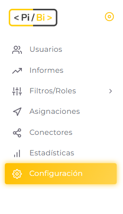
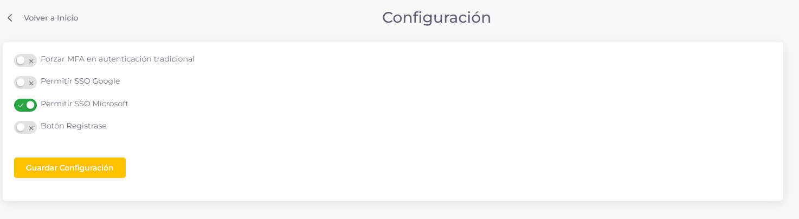

# Sección Configuraciones 

En PiBi el *Usuario Administrador Original* contará con una sección de Configuraciones en el menú lateral.

En la misma, podrá habilitar o deshabilitar distintas funcionalidades

- *MFA*: Al habilitar esta configuración, se forzará un  Segundo Factor de Autenticación que consta de un OTP (One-Time Password) enviado al correo del usuario. Cabe aclarar que esto solo afecta al Inicio de Sesión con Usuario y Contraseña, y se excluye de dicho control al Usuario Administrador Original.
- *SSO Google*: Al deshabilitar esta configuración, los usuarios no tendrán la posibilidad de iniciar sesión con su cuenta de Google.
- *SSO Microsoft*: Al deshabilitar esta configuración, los usuarios no tendrán la posibilidad de iniciar sesión con su cuenta de Microsoft.
- *Botón Registrarse*: Al deshabilitar esta configuración, no se visualizará el botón para registrarse en la plataforma.
