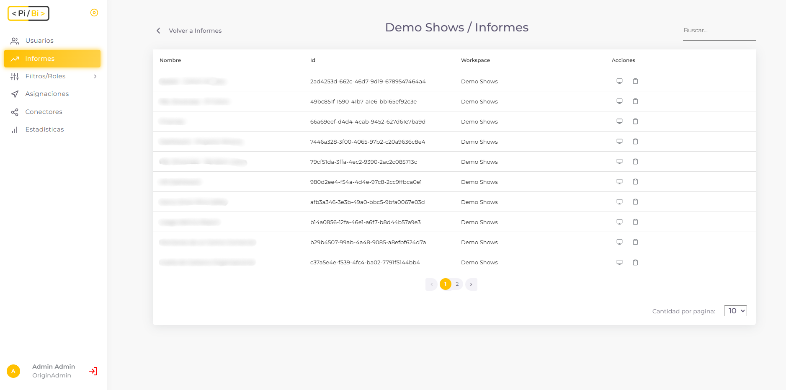

# ¿Qué informes muestra PiBi y cómo sincroniza los cambios de Power BI? 

La lista de informes que muestra PiBi son importados desde los grupos de trabajo de Power BI al cual accedemos con el conector configurado. Por ello al ingresar a la sección de informes podemos ver las áreas de trabajo que fueron sincronizadas.

Al seleccionar una de las áreas de trabajo podemos ver los informes correspondientes.

Estos informes son sincronizados dos veces al día. PiBi se conecta automáticamente y actualiza los informes de su base de datos con los cambios realizados por el equipo de Power BI. 

Además, como usuario administrador vamos a poder sincronizar los informes de forma manual, desde la sección de *Conectores*, pulsando en *Sincronizar Informes*. 
_

Cada vez que se sincronizan los informes (ya sea de forma manual o automática) todos los usuarios administradores de PiBi *son asignados a todos los informes con el rol Admin*. De esta manera los usuarios administradores siempre pueden ver todos los informes de PiBi. 

## ¿Qué ocurre con informes que usen Azure Analysis Services (AAS) en PiBi? 

PiBi es compatible con orígenes de datos de Azure Analysis Services. La principal diferencia con los conjuntos de datos alojados sobre Power Bi Service es que lleva una configuración adicional.
Dado el modo que funciona AAS, tenemos la obligación de utilizar Asignaciones por Roles de seguridad. AAS esta constituido por accesos al modelo basados en roles. Si bien, por defecto AAS crea un rol Admin como el que crea PiBi, también podremos crear unos personalizados.
El proceder es simple y basta de dos pasos claves:
1. Crear un rol en el modelo de AAS. Esta acción puede realizarse desde SQL Management Studio o Visual Studio.
2. Agregar la Aplicación Registrada en Azure dentro del rol creado previamente.
3. Crear rol de seguridad en PiBi con exactamente el mismo nombre que el creado en AAS.
4. Crear la asignación deseada entre el usuario, el informe de origen con AAS y el Rol de seguridad creado.

NOTA: *Cabe aclarar que un informe de Power Bi solo mostrará información en PiBi siempre y cuando el Servicio de AAS este funcionando y no pausado.*

## ¿Qué acciones puedo realizar en la sección de informes? 

Como usuario administrador podemos realizar dos acciones en la sección de informes. Por un lado, podemos visualizar el informe pulsando en el primer
botón de la columna de *Acciones*.

De esta manera accedemos al informe con el rol *Admin*.

La segunda acción que podemos realizar es consultar y modificar las asignaciones de un informe en particular. Eso lo hacemos cuando pulsamos en el segundo botón de la columna de *Acciones*.

De esta manera accedemos a las asignaciones de filtros y roles de seguridad que tiene un informe y podemos modificarlas.

