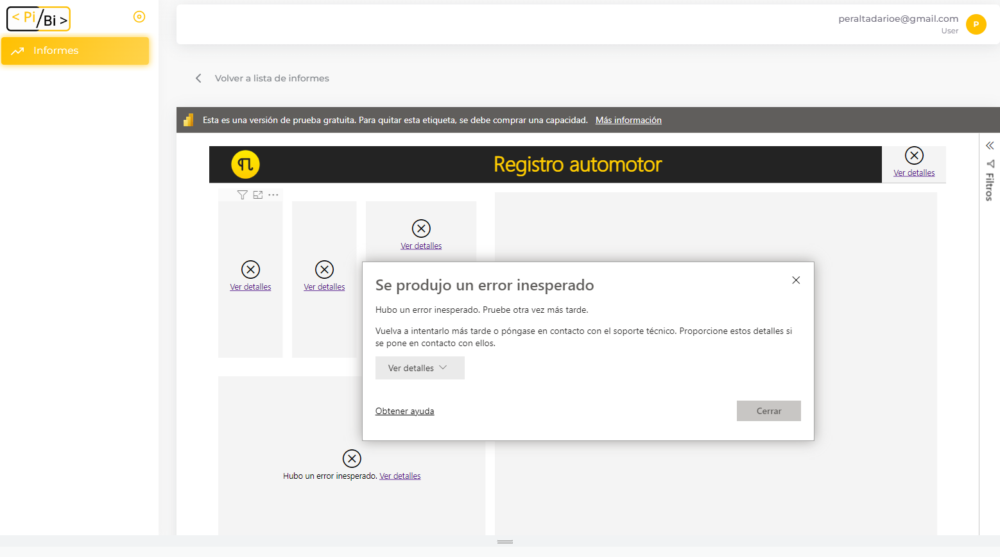
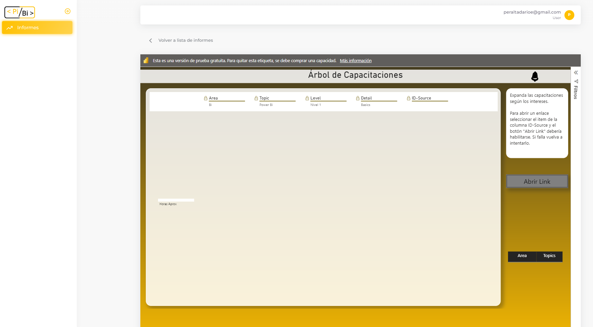

# ¿Qué problemas podemos encontrar al ver un informe? 

En PiBi las Asignaciones nos permitirán indicar los permisos de un usuario para acceder a los informes. A la hora de configurar las asignaciones podemos cometer errores que no permitirán visualizar los informes. 
A continuación se listan ejemplos de problemas que pueden encontrarse.

1. Cuando no coinciden el Rol de Seguridad configurado en PIBI con el existente en Power BI

El nombre del Rol de Seguridad en PIBI debe coincidir con el nombre del RLS configurado en Power BI. El resultado es un mensaje de error al intentar acceder a los datos del informe.
Para el caso de un informe con Azure Analysis Services el resultado es el siguiente.

2. Cuando el valor del filtro no existe en el informe

El valor que se configuró en la asignación de filtro no existe entre las opciones del informe de Power BI. El resultado es que se aplica el filtro con un valor inexistente por lo cual el informe puede aparece sin datos.
3. La tabla y/o columna del filtro son erróneas

La tabla y/o columna del filtro de PIBI no coincide con los valores configurados en el informe de Power BI. El resultado es que no se aplica el filtro en el informe.
4. El recurso de Azure Analysis Services se encuentra pausado o fue borrado

Para acceder a los datos de un informe que utilice Azure Analysis Service es necesario tener el recurso encendido. Si el mismo se encuentra pausado o fue borrado, el resultado es un mensaje indicando que no podemos conectarnos al modelo de datos.