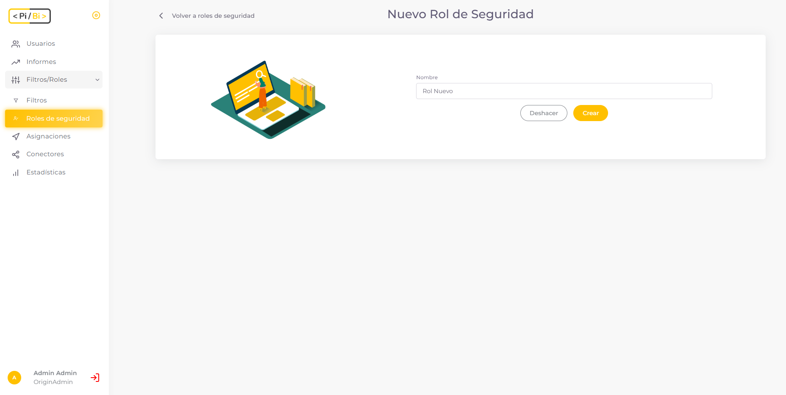

# ¿Qué son y cómo configuramos los Roles de Seguridad? 

En PiBi los *Roles de Seguridad* son configuraciones de permisos para poder acceder a un informe. Están vinculados al concepto de RLS en Power BI y *deben tener el mismo nombre en PiBi.* 

Por defecto PiBi crea dos Roles de Seguridad:
- *Rol de Seguridad Admin*: existe para mantener a todos los usuarios tipo administrador con visibilidad activa de lo que hay sincronizado desde Power Bi a PiBi. 
- *Rol de Seguridad Ninguno*: Es el rol para acceder a informes que no tengan configurado el RLS en Power BI. 

Como administradores siempre tenemos asignado el rol *Admin* para todos los informes de PiBi, gracias a la sincronización automática de informes. Los administradores pueden acceder a informes sin RLS configurado en Power BI. Si RLS fue configurado, solo verán el informe si efectivamente el modelo semántico de Power Bi incluye un rol "Admin" en su interior. Sugerimos crear un rol de RLS "Admin" sin regla cuando queramos utilizar esta protección para que administradores puedan visualizar siempre los informes.

Como administradores podemos crear roles de seguridad y luego asignarlos a los usuarios. 

Para crear un nuevo *Rol de seguridad* pulsamos en el botón *Añadir* de la sección *Roles*. 

Definimos el nombre del rol que estamos por crear. *Este nombre del rol debe ser el mismo que la configuración RLS del conjunto de datos del informe en Power BI que queremos aplicar.*

¡Listo! Acabamos de crear el rol y lo tenemos disponible para crear asignaciones de rol.

Además, podemos modificar o eliminar el rol desde las acciones disponibles en la tabla.

